# Runes & Steel Fighter: Multiplayer Network Game

**Repository**: https://github.com/alvinzanuaputra/Runes-SteelFighter-Games**

**Laporan**: _Come Soon_

**Demo Youtube**: _Come Soon_


## 👥 Nama Anggota Kelompok 6

| Nama | NRP | Pembagian Tugas |
|------|-----|-----------------|
| Muhammad Shafa Narariya | 5025231016 | Membantu menerapkan desain ke dalam game dan perombakan yang ada |
| Thopaz Givangkara Rosadi | 5025231050 | Membuat GUI sebagai tampilan utama dan juga desain seperti halaman utama, karakter, latar belakang, statistik dan alur game |
| Alvin Zanua Putra | 5025231064 | Membuat Front-end game dengan rancangan desain yang ada, membuat logika pertarungan, menerapkan class fighter untuk masing-masing player, serta launcher game |
| Christoforus Indra Bagus Pratama | 5025231124 | Membantu membuat server dan juga load balancer untuk diimplementasikan ke dalam game yang sudah ada |
| Choirul Anam | 5025231145 | Membuat database untuk menyimpan state seperti login, register. Mengimplementasikan server, http, dan load balancer untuk terhubung dengan database |

## 🎮 Deskripsi Game

**Runes & Steel Fighter** adalah game pertarungan 2D multiplayer yang dikembangkan menggunakan Pygame dan terinspirasi dari game klasik Street Fighter. Game ini menggabungkan kekuatan sihir ("runes") yang melambangkan pengetahuan magis kuno dengan kekuatan fisik ("steel") yang mewakili keahlian tempur manusia.

Dalam dunia ini, warrior yang membawa pedang bertarung melawan penyihir yang membawa tongkat sihir. Game ini bukan sekadar adu kekuatan, melainkan benturan filosofi antara dua dunia: mistik dan material fisik.

## 🚀 Fitur Utama

- **Sistem Login & Register**: Autentikasi pemain dengan database
- **Matchmaking System**: Pencarian lawan otomatis dengan timeout 5 menit
- **Statistik Pemain**: Level, EXP, HP, Attack, Armor, Total Match, Win Rate
- **Pertarungan Real-time**: Multiplayer 1 vs 1 dengan sinkronisasi state
- **Arsitektur Client-Server**: Load balancer dengan multiple server backend
- **State Management**: Redis untuk caching state pertarungan
- **Database Integration**: PostgreSQL untuk penyimpanan data permanen

## 🛠️ Teknologi Stack

- **Game Engine**: Python 3.10+ dengan Pygame
- **Database**: PostgreSQL
- **Cache**: Redis Server
- **Network**: Socket Programming dengan HTTP Protocol
- **Load Balancing**: Round Robin Algorithm
- **Data Format**: JSON untuk komunikasi client-server

## 📦 Prasyarat Instalasi

- Python 3.10 atau lebih baru
- PostgreSQL
- Redis Server
- pip (Python Package Manager)

## 🔧 Setup Environment

### 1. Clone Repository
```bash
git clone https://github.com/alvinzanuaputra/Runes-SteelFighter-Games.git
cd Runes-SteelFighter-Games
```

### 2. Install Dependencies
```bash
pip install pygame
pip install psycopg2-binary
pip install redis
```

### 3. Setup Database
```bash
# Buat database PostgreSQL dengan nama "progjar"
# cek database
py database/database.py

# Jalankan migrasi database
python -m database.migrate
```

### 4. Setup Redis Server
```bash
redis-server
```

## 🎮 Cara Menjalankan Game

### **Mode A: Manual Setup**

#### 1. Jalankan Redis Server
```bash
redis-server
```
Pastikan muncul pesan "ready to accept connections"

#### 2. Jalankan Load Balancer
```bash
python load_balancer.py
```
Load balancer akan berjalan di port 8888

#### 3. Jalankan Server Backend
```bash
python server_thread_http.py 8890
python server_thread_http.py 8891
```

#### 4. Jalankan Client
```bash
python client2.py
python client2.py
```
Jalankan di terminal terpisah untuk setiap pemain

### **Mode B: Launcher UI**

#### Jalankan Game Launcher
```bash
python index.py
```

Launcher menyediakan antarmuka untuk:
- Start Load Balancer
- Launch Server (auto-increment port)
- Launch Player
- Terminate All Processes
- Clear Logs

## 🎯 Alur Permainan

### 1. Halaman Login/Register
- Login dengan username dan password yang sudah terdaftar
- Register untuk membuat akun baru dengan nickname, username, dan password

### 2. Halaman Beranda
- Menampilkan statistik pemain (Level, EXP, HP, Attack, Armor, Total Match, Win Rate)
- Tombol Battle untuk memulai matchmaking

### 3. Matchmaking
- Sistem pencarian lawan otomatis
- Timeout 5 menit jika tidak menemukan lawan
- Pemain pertama menjadi host, pemain kedua bergabung sebagai client

### 4. Battle Arena
- Pertarungan real-time dengan sinkronisasi state
- Bar HP untuk setiap pemain
- Sistem damage berdasarkan statistik pemain
- Victory/Defeat screen di akhir pertandingan

## 🕹️ Kontrol Permainan

### Player Controls
| Tombol | Fungsi |
|--------|--------|
| A/D | Bergerak Kiri/Kanan |
| W | Melompat |
| K | Serangan Tipe 1 |
| L | Serangan Tipe 2 |

## 🏗️ Arsitektur Sistem

### Komponen Utama

| Komponen | IP | Port | Fungsi |
|----------|----|----- |--------|
| Client | 127.0.0.1 | Random | Mengirim input dan menerima game state |
| Load Balancer | 0.0.0.0 | 8888 | Distribusi request dengan round robin |
| Server 1 | 127.0.0.1 | 8890 | Backend server pertama |
| Server 2 | 127.0.0.1 | 8891 | Backend server kedua |
| Redis | localhost | 6379 | State management untuk battle |
| PostgreSQL | localhost | 5432 | Database permanen |

### Arsitektur Client-Server
Game menggunakan arsitektur client-server dengan load balancer sebagai distributor request. Setiap request/response dienkode dalam format UTF-8 dengan protokol HTTP.

**1. POST /register HTTP/1.1**

Endpoint ini akan mengirimkan permintaan untuk membuat akun baru dari client dengan data yang harus dikirimkan adalah nickname, username, dan password. Data kemudian akan dienkode ke dalam bentuk JavaScript Object Notation (JSON) terlebih dahulu sebelum dikirimkan. Server akan merespons dengan data kode status, status, pesan, dan headers. Berikut adalah contoh format protokol request dan respons:

```bash
# Request
POST /login HTTP/1.1
Host: localhost
Content-Type: application/json
Content-Length: 43

{"username": "user1", "password": "pass"}
# Respons
HTTP/1.0 200 OK
Date: Sun Jun 29 06:29:00 2025
Connection: close
Server: myserver/1.0
Content-Length: 50
Host:localhost
Content-Type:application/json
Content-Length:77
{"username":"testuser3", "password": "testpass3", "nickname": "Test User 3"}
Content-type:application/json

{"status": "ok", "message": "Registrasi berhasil"}
```

**2. POST /login  HTTP/1.1**

Endpoint ini akan mengirimkan permintaan untuk login dan membuat sesi di server dengan data yang harus dikirimkan adalah username dan password dan dienkode ke dalam bentuk JSON. Server akan memvalidasi username dan password. Jika kedua data tersebut valid, server akan membuat sebuah token untuk client dan menyimpan token tersebut ke dalam database. Server akan mengirimkan data status kode, status, headers, data berupa pesan, token, dan player_id sebagai respons. Berikut adalah contoh format protokol request dan respons:

```bash
# Request
POST /login HTTP/1.1
Host: localhost
Content-Type: application/json
Content-Length: 42
{"username": "user1", "password": "pass1"}
# Respons
HTTP/1.0 200 OK
Date: Sun Jun 29 06:31:51 2025
Connection: close
Server: myserver/1.0
Content-Length: 108
Host:localhost
Content-Type:application/json
Content-Length:42
{"username":"user1", "password": "pass1"}
Content-type:application/json

{"status": "ok", "message": "Login berhasil", "token": "1-df929f2b4f684c26a7cec9735eb36ddc", "player_id": 1}
```

**3. POST /logout  HTTP/1.1\r\n**

Endpoint ini akan mengirimkan permintaan untuk menghapus sesi user di sisi server dengan data yang harus dikirimkan adalah sebuah token yang telah didapatkan dari sesi login. Jika token valid, server akan mengirimkan respons berupa kode status, status, pesan, dan headers. Berikut adalah contoh format protokol request dan respons:

```bash
# Request
POST /logout HTTP/1.1
Host: localhost
Content-Type: application/json
Content-Length: 47

{"token": "1-df929f2b4f684c26a7cec9735eb36ddc"}
Respons
HTTP/1.0 200 OK
Date: Sun Jun 29 06:34:19 2025
Connection: close
Server: myserver/1.0
Content-Length: 46
Host:localhost
Content-Type:application/json
Content-Length:47
{"token":"1-df929f2b4f684c26a7cec9735eb36ddc"}
Content-type:application/json

{"status": "ok", "message": "Logout berhasil"}
```

**4. GET /user/{user_id}  HTTP/1.1\r\n**

Endpoint ini akan mengirimkan permintaan untuk mengambil data player berdasarkan idnya. Data yang harus dikirimkan melalui endpoint adalah user_id. User_id akan digunakan untuk mengambil data pemain di database. Server akan mengirimkan respons berupa status kode, status, pesan, headers, dan data pemain. Berikut adalah contoh format protokol request dan respons:

```bash
Request
GET /user/2 HTTP/1.1
Host: localhost
Respons
HTTP/1.0 200 OK
Date: Sun Jun 29 06:35:18 2025
Connection: close
Server: myserver/1.0
Content-Length: 166
Content-type:application/json

{"status": "ok", "data": {"id": 2, "nickname": "User2", "jumlah_match": 3, "winrate": 33, "level": 1, "exp": 100, "hp": 100, "attack": 10, "armor": 1, "token": null}}
```


**5. POST /search_battle  HTTP/1.1\r\n**

Endpoint ini akan mengirimkan permintaan untuk mencari sebuah player untuk memulai pertarungan. Client akan mengirimkan sebuah token dan user_id. Token digunakan untuk memvalidasi sesi dan bersama user_id digunakan dalam data membuat sebuah room atau bergabung dengan sebuah room jika terdapat room yang sedang tersedia. Pada endpoint ini, jika player tidak menemukan room (lawan), player akan membuat sebuah room dan menunggu maksimal 5 menit sampai ada lawan yang bergabung dengan room. Jika tidak bergabung, maka server mengembalikan respons yang gagal menemukan lawan. Jika room sudah terisi dua player (melalui masing-masing token dan user_id), pertarungan akan dimulai dan server mengirimkan sebuah respons berupa kode status, status, pesan, room_id, self_state, enemy_state, enemy_token, p1 (artinya user termasuk player 1 atau player 2), dan headers. Berikut adalah contoh format protokol request dan respons:

```bash
Request
POST /search_battle HTTP/1.1
Host: localhost
Content-Type: application/json
Content-Length: 63

{"token": "1-20e1e7f96c5645a7b50b30897020cc90", "player_id": 1}
Respons
HTTP/1.0 200 OK
Date: Sun Jun 29 06:38:37 2025
Connection: close
Server: myserver/1.0
Content-Length: 468
Content-type:application/json

{"status": "ok", "message": "Berhasil menemukan lawan", "room_id": "ce7e90f0-5c55-4d17-96d5-cfc5dc332d6e", "self_state": {"token": "1-20e1e7f96c5645a7b50b30897020cc90", "x": 200.0, "y": 480.0, "action": 0, "attack_type": null, "health": 100, "armor": 1}, "enemy_state": {"token": "2-01a61685b53e4ea691e55811c05dcb17", "x": 800.0, "y": 480.0, "action": 0, "attack_type": null, "health": 100, "armor": 1}, "enemy_token": "2-01a61685b53e4ea691e55811c05dcb17", "p1": true}
```

**6. POST /battle  HTTP/1.1\r\n**

Endpoint ini akan mengirimkan permintaan untuk memberikan perubahan terbaru ke server terkait state player yang sedang berada dalam pertarungan. Data yang harus dikirimkan adalah token, enemy_token, room_id, dan state dari player. Berdasarkan room_id, server akan mengirimkan perubahan state ke server redis yang disimpan berdasarkan room_id dengan identifikasi state antara player dan enemy melalui tokennya. Server akan memberikan respons berupa kode status, status, pesan, state player, dan state enemy, headers. Berikut adalah contoh format protokol request dan respons:

```bash
Request
POST /battle HTTP/1.1
Host: localhost
Content-Type: application/json
Content-Length: 258

{"room_id": "ce7e90f0-5c55-4d17-96d5-cfc5dc332d6e", "token": "2-01a61685b53e4ea691e55811c05dcb17", "enemy_token": "1-20e1e7f96c5645a7b50b30897020cc90", "action": 1, "attack_type": 2, "flip": false, "health": 100, "armor": 1, "x": 650, "y": 380, "damage": 20}
Respons
HTTP/1.0 200 OK
Date: Sun Jun 29 06:39:55 2025
Connection: close
Server: myserver/1.0
Content-Length: 338
Content-type:application/json

{"status": "ok", "message": "Battle updated", "self": {"token": "2-01a61685b53e4ea691e55811c05dcb17", "x": 650, "y": 380, "action": 1, "attack_type": 2, "health": 100, "armor": 1, "flip": false}, "enemy": {"token": "1-20e1e7f96c5645a7b50b30897020cc90", "x": 200.0, "y": 480.0, "action": 0, "attack_type": null, "health": 100, "armor": 1}}
```

**7. POST /register HTTP/1.1**

Endpoint ini akan mengirimkan sebuah hasil dari game dengan data berupa player_id, token, is_win, dan room_id. Di endpoint ini, server akan memvalidasi sesi menggunakan token, mencatat perubahan statistik ke database, dan menghapus state di server redis berdasarkan room_id. Server akan mengirimkan respons berupa kode status, status, pesan, dan headers. Berikut adalah contoh format protokol request dan respons:

```bash
# Request
PUT /update_match HTTP/1.1
Host: localhost
Content-Type: application/json
Content-Length: 130

{"token": "2-01a61685b53e4ea691e55811c05dcb17", "player_id": 2, "room_id": "ce7e90f0-5c55-4d17-96d5-cfc5dc332d6e", "is_win": true}
# Respons
HTTP/1.0 200 OK
Date: Sun Jun 29 06:43:13 2025
Connection: close
Server: myserver/1.0
Content-Length: 57
content-type:application/json

{"status": "ok", "message": "Match updated successfully"}
```


## 🎨 Fitur Visual

- **Sprite Animation**: Animasi karakter yang detail
- **Background**: Arena pertarungan yang immersive
- **UI Elements**: Health bar, statistik pemain, dan menu navigasi
- **Victory/Defeat Screen**: Layar hasil pertandingan

## 🔍 State Management

### Redis Cache
- Menyimpan state pemain yang sedang bertanding
- Komunikasi cepat antar server untuk menghindari lag
- Otomatis terhapus setelah pertandingan selesai

### PostgreSQL Database
- Data permanen: user accounts, statistik, session tokens
- Relasi tabel: users, sessions, rooms
- Auto-increment untuk level dan EXP

## 🚀 Fitur Lanjutan

- **Load Balancing**: Round robin algorithm untuk distribusi load
- **Session Management**: Token-based authentication
- **Real-time Synchronization**: State sync antar pemain
- **Matchmaking System**: Otomatis mencari lawan dengan timeout
- **Statistics Tracking**: Level, EXP, win rate, dll.

## 📊 Monitoring & Logging

Game menyediakan logging untuk:
- Koneksi client ke load balancer
- Request/response HTTP
- Database operations
- Redis state changes
- Battle events

## 🔧 Troubleshooting

### Common Issues:
1. **Database Connection**: Pastikan PostgreSQL running dan database "progjar" sudah dibuat
2. **Redis Connection**: Jalankan `redis-server` sebelum start game
3. **Port Conflict**: Pastikan port 8888, 8890, 8891 tidak digunakan aplikasi lain
4. **Matchmaking Timeout**: Pastikan minimal 2 client running untuk matchmaking

## 📝 Catatan Pengembangan

Game ini dikembangkan sebagai tugas akhir mata kuliah Pemrograman Jaringan dengan fokus pada:
- Implementasi protokol jaringan
- Arsitektur client-server
- Load balancing
- Database integration
- Real-time multiplayer gaming


## 📋 Dokumentasi Video

https://github.com/user-attachments/assets/3fd8264a-6e47-445a-a202-179a0fc31e29


## 📋 Dokumentasi Gambar

`1. Sebelum run game, pastikan membuat database dengan nama “progjar” di PostgreSQL. Database ini digunakan untuk menyimpan users, session, dan juga room`

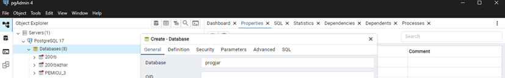
 
`2. Lakukan migrasi database ke dalam Postgre dengan menjalankan database.py dan perintah `py -m database.migrate` di folder root terluar`

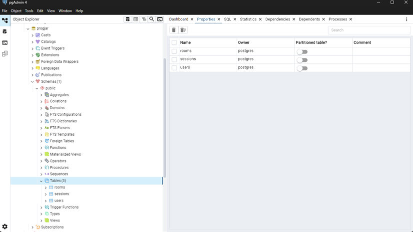
 
`3. Sebelum menjalankan load balancer dan server, lakukan perintah redis-server untuk menyimpan data state. Disini terlihat “ready to accept connections” yang artinya redis server siap menyimpan state database, disini redis server akan **merespon** ketika selesai pertandingan dan save data pertandingan terakhir ke database.`

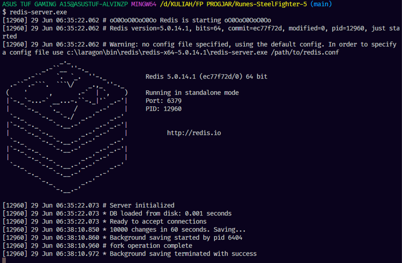
 
`4. Jalankan load_balancer.py diikuti beberapa server.py {port}, pastikan port yang dimasukkan tersedia dalam load balancer agar algoritma round robbin dapat berjalan. Terlihat “[LOAD BALANCER] Client connected from ('127.0.0.1', 61604)” yaitu load balancer menerima response dari server ketika menangani sebuah request. Untuk di bagian server disitu terlihat “accepted form … INFO sqlalchemy…. Dan seterusnya” artinya server menangani request dari client yang mana respon-respon ini adalah timbal balik dari simpan database berupa login,register. simpan dan kemunikasi antar client yaitu menyimpan data state seperti exp, armor, attack, winrate, dll setelah selesai pertandingan.`

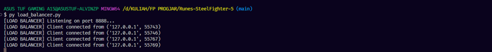

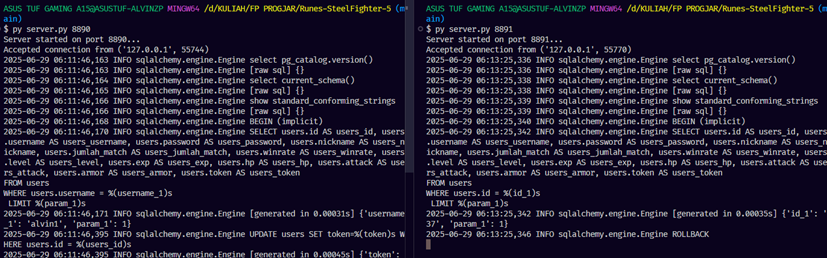
  
`5. Jalankan client2.py pada beberapa terminal untuk multiplayer. Disini client bertugas menjadi pengirim permintaan message dan response header saat menangani request dalam format JSON.`

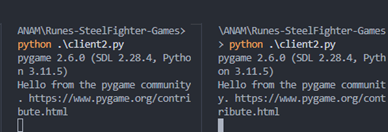

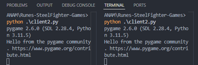

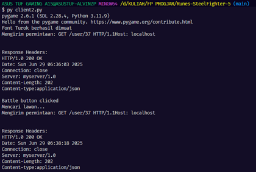

`6. Lakukan validasi akun yaitu pendaftaran akun (Register) apabila tidak punya akun dan login apabila sudah melakukan pendaftaran agar bisa menjalankan gamenya.`
 
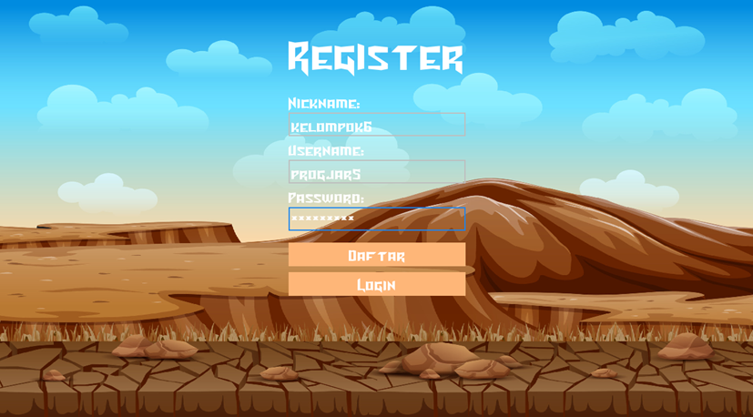

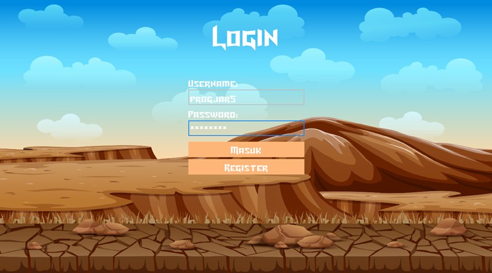

`7. Masuk ke halaman beranda yang menampilkan statistik pemain dan juga tombol untuk battle, host pertama yang menekan tombol battle akan menjadi host server, lalu untuk host kedua jika menekan tombol battle akan otomatis join menjadi client dengan host pertama.`

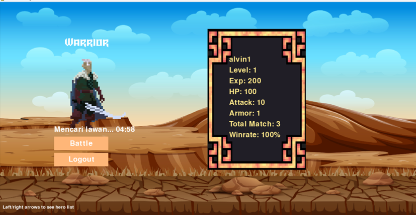
 
`8. Kontrol game disini untuk mengalahkan musuh perhatikan bar HP lalu, tekan tombol A atau D untuk bergerak maju atau mundur untuk W digunakan untuk lompat, dan ada 2 serangan berbeda yaitu dengan tombol K dan L damage serangan sesuai history player yang pernah bermain. dan yang menang atau yang kalah akan ada scene selesai pertandingan yaitu “Victory” atau “Defeat”.`

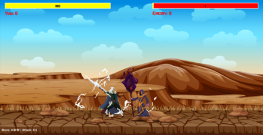

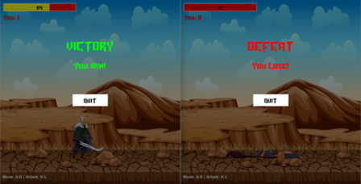
 
`9.  Tambahan Launcher Game disini dalam file index.py adalah sebuah launcher untuk menjalankan konfigurasi bermain yang lebih simple dan tidak perlu menjalankan program satu per satu dan tersedia beberapa log,  dalam menekan tombol kongfigurasi urutan nya sama seperti proses diatas tadi.`

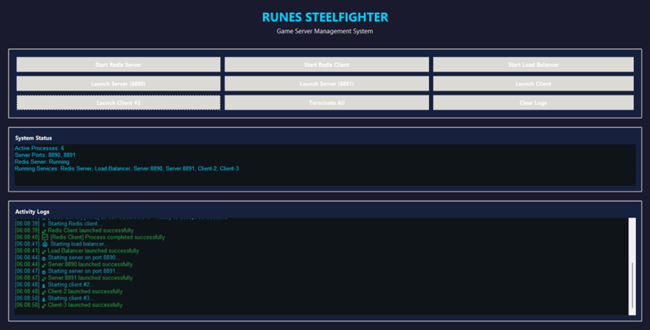


## Kesimpulan 

Runes & Steel Fighter membuktikan bahwa konsep pemrograman jaringan dapat diimplementasikan secara efektif dalam konteks game development. Load balancer berhasil menangani beberapa server backend secara bersamaan menggunakan algoritma round-robin, mampu mendistribusikan dan mengelola ratusan request dalam format JSON yang dikirim melalui HTTP headers dengan method GET, POST, dan PUT.

Sistem ini mendemonstrasikan skalabilitas yang baik dimana multiple clients dapat berkomunikasi dengan multiple servers melalui satu titik entry (load balancer), memastikan tidak ada server yang overload dan response time tetap optimal. 

---

## 📋 Informasi Mata Kuliah
**Mata Kuliah:** Pemrograman Jaringan  
**Dosen Pengampu:** Royyana Muslim Ijtihadie, S.Kom.,M.Kom., Ph.D.  
**Tahun Akademik:** 2024/2025  
**Program Studi:** Teknik Informatika  
**Institut Teknologi Sepuluh Nopember**
