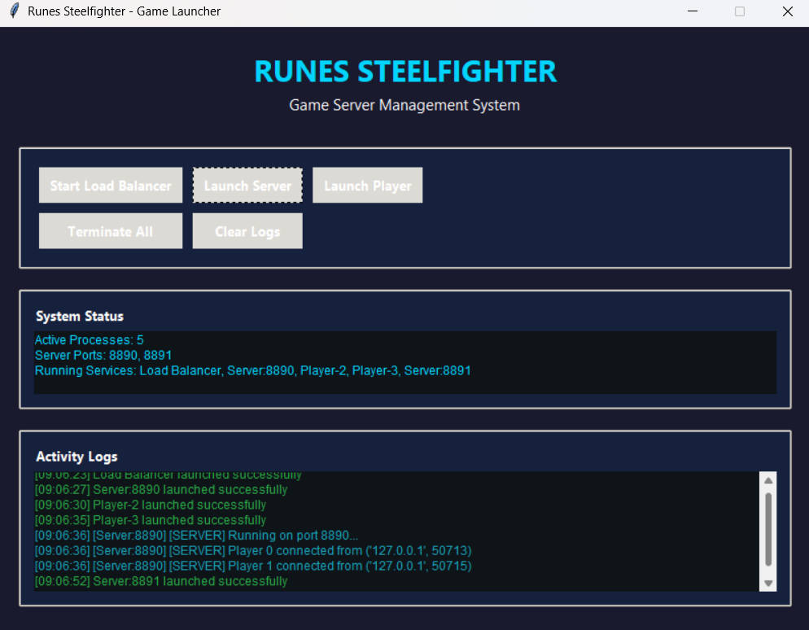

# Runes & Steel Fighter: Multiplayer Pixel Fighting Game

# Nama Anggota Kelompok

| Nama | NRP | Kelas |
|------|-----|-------|
| Muhammad Shafa Narariya | 5025231016 | Pemrograman Jaringan D |
| Thopaz Givangkara Rosadi | 5025231050 | Pemrograman Jaringan D |
| Alvin Zanua Putra | 5025231064 | Pemrograman Jaringan D |
| Christoforus Indra Bagus Pratama | 5025231124 | Pemrograman Jaringan D |
| Choirul Anam | 5025231145 | Pemrograman Jaringan D |

## 🎮 Deskripsi

Runes & Steel Fighter adalah game pertarungan multiplayer bergaya piksel yang terinspirasi dari mekanika klasik Street Fighter. Game ini dikembangkan menggunakan Python dan Pygame.

## 🚀 Fitur Utama

- Pertarungan multiplayer 1 vs 1
- Dua karakter unik: Warrior dan Wizard
- Sistem pertarungan terinspirasi Street Fighter
- Animasi sprite yang detail
- Efek suara dan musik latar
- Load balancer untuk manajemen server
- Kontrol intuitif

## 🛠️ Teknologi Stack

- Python 3.10+
- Pygame
- Socket Programming
- Multiplayer Networking

## 📦 Prasyarat Instalasi

- Python 3.10 atau lebih baru
- pip (Python Package Manager)

## 🔧 Instalasi Dependensi

```bash
git clone https://github.com/alvinzanuaputra/Runes-SteelFighter-Games.git
cd Runes-SteelFighter-Games
pip install pygame
```

## 🎮 Cara Menjalankan Game

### **A. Manual Mode :**

### 1. Jalankan Load Balancer
```bash
python load_balancer.py
```

### 2. Jalankan Server
```bash
python server.py [port]  # Contoh: python server.py 8890
```

### 3. Jalankan Pemain 1
```bash
python player.py
```

### 4. Jalankan Pemain 2
```bash
python player.py
```

**NB :** `Jika ingin menambahkan server jalankan server py [port selanjutnya] dan jalankan player ketika load balancer sudah dijalankan`

#### 5. Contoh Ouput Running 


```bash
ASUS TUF GAMING A15@ASUSTUF-ALVINZP MINGW64 /d/KULIAH/FP PROGJAR/Runes-SteelFighter-Load Balancer
$ py server.py 8890
[SERVER] Running on port 8890...
[SERVER] Player 0 connected from ('127.0.0.1', 62528)
[SERVER] Player 1 connected from ('127.0.0.1', 62534)
```

```bash
ASUS TUF GAMING A15@ASUSTUF-ALVINZP MINGW64 /d/KULIAH/FP PROGJAR/Runes-SteelFighter-Load Balancer
$ py load_balancer.py
[LOAD BALANCER] Listening on port 8888...
[LOAD BALANCER] Client connected from ('127.0.0.1', 62485)
[LOAD BALANCER] Client connected from ('127.0.0.1', 62494)
[LOAD BALANCER] Client connected from ('127.0.0.1', 62527)
[LOAD BALANCER] Client connected from ('127.0.0.1', 62533)
[LOAD BALANCER] Client connected from ('127.0.0.1', 62541)
[LOAD BALANCER] Client connected from ('127.0.0.1', 62555)
[LOAD BALANCER] Client connected from ('127.0.0.1', 62624)
[LOAD BALANCER] Client connected from ('127.0.0.1', 62627)
```


```bash
ASUS TUF GAMING A15@ASUSTUF-ALVINZP MINGW64 /d/KULIAH/FP PROGJAR/Runes-SteelFighter-Load Balancer
$ py server.py 8891
[SERVER] Running on port 8891...
[SERVER] Player 0 connected from ('127.0.0.1', 62625)
[SERVER] Player 1 connected from ('127.0.0.1', 62628)
```

```bash
ASUS TUF GAMING A15@ASUSTUF-ALVINZP MINGW64 /d/KULIAH/FP PROGJAR/Runes-SteelFighter-Load Balancer
$ py player.py 
pygame 2.6.1 (SDL 2.28.4, Python 3.11.9)
Hello from the pygame community. https://www.pygame.org/contribute.html
Connected as Player 0
```


```bash
ASUS TUF GAMING A15@ASUSTUF-ALVINZP MINGW64 /d/KULIAH/FP PROGJAR/Runes-SteelFighter-Load Balancer
$ py player.py 
pygame 2.6.1 (SDL 2.28.4, Python 3.11.9)
Hello from the pygame community. https://www.pygame.org/contribute.html
Connected as Player 1
```


```bash
ASUS TUF GAMING A15@ASUSTUF-ALVINZP MINGW64 /d/KULIAH/FP PROGJAR/Runes-SteelFighter-Load Balancer
$ py player.py 
pygame 2.6.1 (SDL 2.28.4, Python 3.11.9)
Hello from the pygame community. https://www.pygame.org/contribute.html
Connected as Player 0
```


```bash
ASUS TUF GAMING A15@ASUSTUF-ALVINZP MINGW64 /d/KULIAH/FP PROGJAR/Runes-SteelFighter-Load Balancer
$ py player.py 
pygame 2.6.1 (SDL 2.28.4, Python 3.11.9)
Hello from the pygame community. https://www.pygame.org/contribute.html
Connected as Player 1
```


### **A. Instant Mode :**

### Jalankan UI Launcher 

```bash
python main.py
```

**Gambar UI :**



`Jadi untuk deskripsi tombolnya yaitu "Start Load Balancer" untuk menjalankan load balancer, "Launch Server" untuk membuat server di port tertentu, "Terminate All" untuk menghentikan semua proses yang sedang berjalan, dan "Clear logs" untuk membersihkan console terminal hasil berjalanya program.`

`Disini hanya perlu mengulangi metode persis di tipe mode manual mode hanya saja menggunakan UI tombol dimana start load balancer, start server pertama akan otomatis binding di port default 8890, dan launch player 2 kali.`

`Kemudian apabila ingin menjalankan server kedua cukup biarkan load balancer berjalan, start server akan otomatis di port selanjutnya yaitu 8891 karena port 8890 masih berjalan dan akan auto increment hingga seterusnya lalu launch player 2 kali.`

## 🕹️ Kontrol Permainan

### Player 1 (Warrior)
| Tombol | Fungsi |
|--------|--------|
| A | Bergerak ke Kiri |
| D | Bergerak ke Kanan |
| W | Melompat |
| K | Serangan 1 |
| L | Serangan 2 |

### Player 2 (Wizard)
| Tombol | Fungsi |
|--------|--------|
| ← | Bergerak ke Kiri |
| → | Bergerak ke Kanan |
| ↑ | Melompat |
| Z | Serangan 1 |
| X | Serangan 2 |

## 🔍 Arsitektur Sistem

### Load Balancer
- Mengelola koneksi klien
- Mendistribusikan klien ke server yang tersedia
- Port default: 8888

### Server
- Menangani logika permainan
- Sinkronisasi status pemain
- Port default: 8890-8899

### Klien (Player)
- Mengirim input pemain
- Menerima dan memperbarui status permainan

**NB :** `Untuk penjelasan arsitektur kode masing-masing file bisa klik disini :`

[](./README-CODE.md)

## 🎨 Lampiran

### Bar HP dan Skor


### Layar Kemenangan
